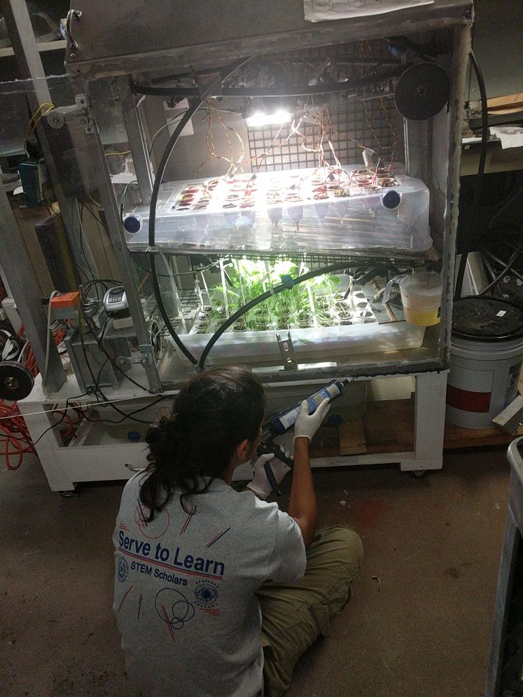

# NASA University Student Design Challenge | 2017-2018

## Design Challenge Goal

* To maintain an Earth-independent colony by developing agricultural techniques that can be used to extract, refine, and store essential resources.
* These agricultural techniques will be applied to different plant species to extract the highest quantities of food, oxygen, and biofuels. 
* To model this theoretical design the team will be building a prototype that will mimic the Mars soil environment.

## NASA USDC Challenge Description

The USDC–2 presents two Design Challenge options, one focused on aeronautics and one focused on space. The aeronautics challenge, challenges student teams to design a suburban city with infrastructure and accommodations for flying cars and service vehicles. **The space challenge challenges students to conceptually design a space-focused bioinspired system to extract resources from extraterrestrial bodies typical of Mars into systems for human habitation in the solar system.**

## More General Info About the Project

* [PowerPoint](./info/SRC-ppt-presentation.pptx)
* [Project Proposal (PDF)](./info/Final-Project-Proposal.pdf)
* [Project Video](https://drive.google.com/file/d/1ZdMT2zUvB7LMSy3pApv9duj9gVsUERxI/view?usp=sharing)
* [Project Poster](./info/NASA-design-challenge-poster.pptx)

## System Automation

To automate the system an Arduino microcontroller was set up to collect, manipulate, and store data. This data was then used to make changes depending on the moisture levels, temperature, and humidity.

## Project Code

### Arduino

The purpose of the arduino is to collect sensory data from 20 different sensors which can be seen below:

* 16 moisture sensors
* A temperature and humidity sensor (DHT22)
* 4 piezoelectric sensors
* other miscellaneous sensors

Figure 1 shows how all the sensors are inside of the artificial environment and Figure 2 shows how the arduino is wired outside the environment.


**Figure 1** - Sensors shown above: moisture, humidity and temperature.

#### How does it work?

After letting the Arduino Mega know which sensors are which and opening the serial port over USB, we are able to indefinitely loop through the following code:

This first part uses the [DHT22 Library](https://github.com/adafruit/DHT-sensor-library) to read the Humidity and Temperature off DHT22 sensor and outputs a message if it doesn't pick up a reading.

```c
  float h = dht.readHumidity();
  // Read temperature as Celsius (the default)
  float t = dht.readTemperature();
  // Read temperature as Fahrenheit (isFahrenheit = true)
  float f = dht.readTemperature(true);
  
  // Check if any reads failed and exit early (to try again).
  if (isnan(h) || isnan(t) || isnan(f)) {
    Serial.println("Failed to read from DHT sensor!");
    return;
  }
```

If everything goes well, the next part is to print the data on the serial port which the Raspberry will later save.

```c
    Serial.print(h);
    Serial.print(",");
    Serial.print(t);
    Serial.print(",");
    Serial.print(f);
    Serial.print(",");
```

The last part is to collect all sensor data the 16 moisture sensors shown on Figure 1. For that, I used a for loop tha goes through every single sensor and prints the values onto the serial port.

```c

  for(int i=0; i<SensorNumber; i++)
  {
    digitalWrite(soilPower[i], HIGH);
    delay(10);
    val[i]=analogRead(soilPin[i]);
    digitalWrite(soilPower[i], LOW);

    int number = i+1;
    int value = val[i];

    Serial.print(value);
    Serial.print(",");
    number++;
 }
```

The full code can be seen [here](./code/arduino/data-collector/data-collector.ino).


**Figure 2** - The Arduino Mega that's connected to the Raspberry Pi through its USB Serial Port.

### Raspberry Pi

The Raspberry Pi was one of the most challenging devices to setup. At the start of this challenge, I had 0 experience with Linux and SSH but after weeks of researching I was able to create a static IP address that allowed me to remotely access the pi.


**Figure 3** - The Raspberry Pi collecting the data through serial

#### How does it work?

The purpose of the Rasbperry Pi is to collect all the serial port data and then export it as a CSV file. Like I mentioned above, I had no idea what or how things worked. This was also my first intro to Python so the code found online made no sense.

The library that allowed me to collect the data being sent through serial was the grabserial one shown below. All you have to do is pass a couple of arguments like:

```python
    python getSerial.py /dev/ttyACM0 9600 temp-readings.csv
```

In the example above, the last three parameters are for:

1) The location of the Serial port
2) Baud Rate (the data rate in bits per second) for serial data transmission.
3) The name of the file.

The libraries that were used to collect the data are shown below:

* [pySerial](https://github.com/pyserial/pyserial)
* [grabserial](https://github.com/tbird20d/grabserial) - This is the one that I ended up using on this project as it was easy to setup. (shown on Figure 3).

Code for this can be found [here](./code/python/getSerial.py).

## Data

So the data that was collected can be seen on this [file](./data/readings_3-30.csv) and at the time we didn't have the time or knowledge to analyze it. After the challenge was over, I contacted a professor to see if he could help me and he redirected me to one of his students that found the data to be inconclusive due to:

1) All the moisture sensors had the same average values across the sessions we had. Meaning that the soil samples we had were all holding the same moisture back. Geologically speaking this is inaccurate since some of the samples came from areas where moisture levels are always low. One theory we had as to why this happened was that the sensors were really cheap compared to some of the more expensive moisture sensors (that can end up starting at $40 a piece). 

2) The 4 piezoelectric sensors that were in charge of collecting the lighting were not reading correctly. As a matter of fact, after a while they just ended up dying so we removed them from our research. The only thing that seemed to be working correctly was the DHT22 (humidity and temperature sensor).

## Design Constraints and Challenges

* Data Analytics - No one on the team knew how to get something meaningful out of the data I had collected so not much could be done during the last few weeks of the challenge.
* Prototype limitations - The environment itself wasn't vacuum sealed from the outside environment which could have messed with the data.
* Time limitations - We didn't get to start putting the environment together until the start of January which left us with a total of 3-4 months to test and collect the data.

## Challenge Outcome

When I entered the team challenge, I didn't think I would be working closely with members in other fields but this experience helped me explain the computer science concepts to those that were not in my field in layman terms. Another thing I learned was how to set priorities while working in an ambitious challenge such as this one. There were a lot of things that I wanted to do but weren't that big of a priority.

Something I wish I had done differently was explored the field of data science. The data I had collected was pretty much meaningless since no one on the team knew how to analyze it.

## More Photos


**Figure 4** - Start of the environment development.


**Figure 5** - Preparing the soil samples.


**Figure 6** - The samples being added to the environment.


**Figure 7** - During this phase, I went around testing every Moisture sensor to make sure they were working properly.


**Figure 8** - This is how the environment looked like before we installed the sensors.


**Figure 9** - Final days of the project.
